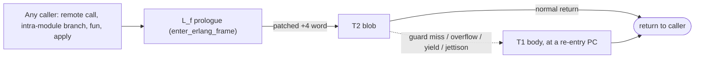
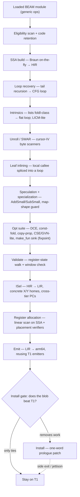
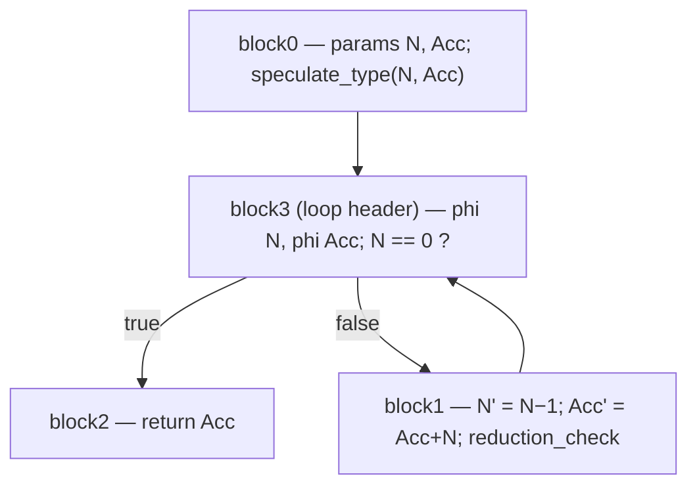
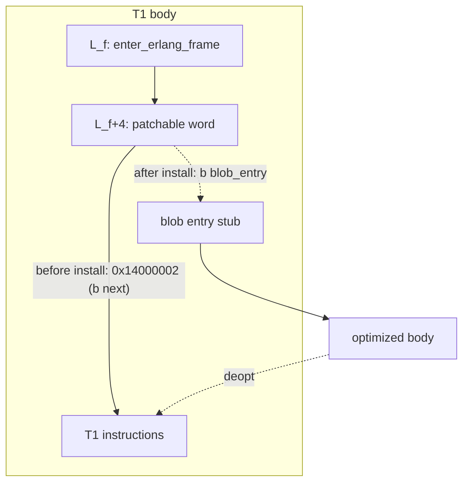

<!--
%% %CopyrightBegin%
%%
%% SPDX-License-Identifier: Apache-2.0
%%
%% Copyright Ericsson AB 2026. All Rights Reserved.
%%
%% Licensed under the Apache License, Version 2.0 (the "License");
%% you may not use this file except in compliance with the License.
%% You may obtain a copy of the License at
%%
%%     http://www.apache.org/licenses/LICENSE-2.0
%%
%% Unless required by applicable law or agreed to in writing, software
%% distributed under the License is distributed on an "AS IS" BASIS,
%% WITHOUT WARRANTIES OR CONDITIONS OF ANY KIND, either express or implied.
%% See the License for the specific language governing permissions and
%% limitations under the License.
%%
%% %CopyrightEnd%
-->

# BeamAsm Tier 2 (T2-Full), the optimizing JIT

BeamAsm Tier 2 ("T2-Full") is a profile-driven *optimizing* second tier for the
BEAM JIT. The tier-1 JIT ([BeamAsm](BeamAsm.md)) translates each BEAM
instruction to native code one instruction at a time, with essentially no
cross-instruction optimization. Tier 2 instead reconstructs an SSA intermediate
representation from the already-loaded BEAM code, runs a small BEAM-specific
optimizing mid-end over it, and installs the resulting machine code *over* the
T1 function. T1 always stays intact underneath as the fallback: any side exit,
guard miss, or unhandled event deoptimizes back into the T1 body.

Two properties frame everything else in this document:

* **Tier 2 is a specialist, not a general accelerator.** It makes a narrow class
  of hot code — integer/float tail loops and byte scanners — substantially
  faster, and is designed to fall back cleanly to the T1 floor on everything
  else rather than risk slowing it down.
* **Tier 2 is safe by construction.** It never changes observable behaviour,
  never raises where T1 would not, counts reductions identically, and keeps
  stack introspection byte-identical. A static install-quality gate declines to
  install a blob at all unless it can show it removes work relative to T1.

Tier 2 is **aarch64-only** and **opt-in** — off by default, with no plan to turn
it on by default. The mid-end (HIR, LIR, instruction selection, register
allocation) is architecture-independent and compiles on every JIT target, but
the code emitter is aarch64 assembler; on any other target the backend compiles
out to stubs and no blob is ever installed.

## What it delivers

| workload shape | speedup vs T1 |
|---|---|
| single-clause byte scan-and-count kernels (validators, lexers) | 2.5–3.1× (Apple Silicon), up to ~16× digit-scan on server ARM |
| integer/float tail loops (arithmetic accumulation, `lists:foldl/3`-class) | 1.4–2.0× |
| everything else | never slower than T1 — the install gate keeps non-winning blobs from installing |

The reason the third row is "never slower" and not "a little faster" is the
central architectural finding of the tier: **T2 beats T1 only when it removes
work** — inlines a call, fuses unboxed arithmetic, or fuses a per-byte loop into
a wide scan. A blob that merely re-emits T1's instructions plus speculation
guards can at best tie, and usually loses. The gate (below) turns that finding
into policy.

## Relationship to Tier 1

Tier 2 does not replace T1; it sits on top of it and depends on it three ways.



1. **T1 is the deopt floor.** The T1 body of every function is left completely
   intact. Every side exit from a T2 blob re-establishes the exact register
   state T1 expects and branches to a T1 machine-code address inside that body.
   T2 never raises exceptions itself and never lands the process instruction
   pointer on a blob address that T1 cannot resume from.

2. **T2 installs behind the T1 prologue.** Installation is a single-word patch of
   the T1 function prologue — the same trampoline word that tracing and NIF
   loading use — so every caller kind is caught without touching export entries.

3. **T2 reuses T1's emitters.** The Tier-2 assembler subclasses the aarch64
   module assembler and calls the same per-instruction emitters T1 uses, with
   the fail labels redirected to deopt trampolines. This keeps the two tiers
   bit-compatible on everything T2 does not deliberately optimize.

## Architecture at a glance

One function flows through the pipeline below. Any failure at any stage degrades
that function to T1 — never an error, never an aborted load. The mid-end is
described in detail in [The HIR](#the-hir-high-level-ir) and
[Optimizations on the HIR](#optimizations-on-the-hir); the worked example in
[From BEAM to arm64](#from-beam-to-arm64-a-worked-example) traces one function
through the whole thing.



The stages divide into a **front** that turns retained BEAM into optimized,
validated HIR, and a **back** that lowers HIR to an installed native blob.

* **Eligibility + retention.** A function is eligible iff every generic BEAM op
  in its body is in the supported set (see [Eligibility](#eligibility-what-t2-compiles)).
  Because everything the loader parsed is freed right after T1 emission, when the
  tier is enabled retention *copies* what the SSA builder will need — the raw
  code-chunk bytes (re-decoded later), the atom/import/type tables, the literal
  map, the per-function eligibility bitmap, and (for the counter path) the
  profiling records — into one module-lifetime allocation.
* **SSA build.** The retained code chunk is re-decoded to *generic, pre-transform*
  ops — the same level the compiler's code generator emitted, which is exactly
  the level SSA reconstruction wants. SSA is built with the Braun *et al.*
  on-the-fly algorithm (local value numbering per block, operandless phis on
  unsealed blocks, a seal pass once the CFG is known). See [The HIR](#the-hir-high-level-ir).
* **Mid-end.** Loop recovery, intrinsics, unrolling, inlining, speculation, and
  the classic cleanup suite, then two validators. See
  [Optimizations on the HIR](#optimizations-on-the-hir).
* **Back end.** Instruction selection to LIR, linear-scan register allocation,
  emission to a native blob, the install gate, and installation. See
  [Lowering to native code](#lowering-to-native-code).

## The HIR (high-level IR)

The HIR is a block-structured, arena-allocated SSA IR with explicit phi nodes.
It maps closely onto BEAM SSA ops, extended with what speculation, unboxing, and
deopt need. It is deliberately backend-neutral — no asmjit or register-machine
types appear in it — so the whole mid-end is portable and the aarch64 specifics
live only in the emitter.

### Values, blocks, and functions

* A **value** (`T2Value`) is the result of exactly one op (SSA). It carries a
  dense id, its defining op, and a **type** drawn from the lattice below.
* An **op** (`T2Op`) has a kind, a result value (or none, for effect-only ops),
  an operand array, and — crucially for correctness — its *canonical homes* and,
  where relevant, a *sync map* (both described below). Terminators additionally
  carry successor blocks / switch cases.
* A **block** (`T2BasicBlock`) holds a list of phi nodes, a list of body ops in
  program order, and one terminator. Predecessor arrays are computed from
  successors when the CFG is finalized.
* A **function** (`T2Function`) owns the arena, the block and value lists, the
  entry sync map, and the set of cross-module code headers its blob depends on.

### The op set

Ops are grouped by category. The set is intentionally close to BEAM SSA so the
identity lowering is bit-compatible with T1; the additions are the speculative,
unboxing, binary-scan, and intrinsic-support ops.

| category | ops | notes |
|---|---|---|
| **constants / params** | `ConstInt` `ConstFloat` `ConstAtom` `ConstNil` `ConstLiteral` `Param` `Phi` | SSA leaves and merges |
| **copy** | `Copy` | SSA-identity of its operand; exists only for *placement* — `dst_reg` names the BEAM register the copy fills, so later sync points find the value in its canonical home (mirrors `move`/`swap`) |
| **type tests** | `IsInteger` `IsAtom` `IsTuple` `IsList` `IsNonemptyList` `IsNil` `IsBinary` `IsBitstring` `IsMap` `IsFloat` `IsNumber` `IsBoolean` `IsPid` `IsPort` `IsReference` `IsFunction` `IsTaggedTuple` `TestArity` `Succeeded` | produce a boolean consumed by a `Branch` |
| **comparisons** | `CmpEqExact` `CmpNeExact` `CmpEq` `CmpNe` `CmpLt` `CmpLe` `CmpGt` `CmpGe` | |
| **generic arithmetic** | `Add` `Sub` `Mul` `IDiv` `Rem` `Band` `Bor` `Bxor` `Bsl` `Bsr` `Bnot` `Neg` | may allocate a bignum, may raise — carry a sync map |
| **speculative arithmetic** | `AddSmall` `SubSmall` `MulRaw` `UntagInt` `TagInt` | flag-checked small-int fast paths, planted by speculation |
| **speculation guards** | `SpeculateType` `SpeculateRange` | runtime tag/range tests that deopt on a miss |
| **tuples / lists** | `MakeTuple` `GetTupleElement` `MakeList` `GetHd` `GetTl` | |
| **map match** | `GetMapElement` | read-only key lookup; the map-shape specialization rides this op |
| **maps:fold flatmap** | `IsFlatmapBounded` `FlatmapSize` `FlatmapKeyAt` `FlatmapValAt` `FoldBudget` | synthesized only by the fold expander, never decoded from BEAM |
| **binary scan** | `StartMatch` `BsMatch` `BsGetTail` `BsTestTail` | the byte-aligned matching subset |
| **cursor-IV + SWAR** | `BsBase` `BsLimit` `BsCursor` `BsEnsure` `BsRead` `BsSync` `BsGetPosition` `BsSetPosition` `BsLoadWord` `SwarByteSum` `SwarAsciiTest` | decompose a match context into a raw bit-cursor induction variable so byte loops can unroll and SWAR |
| **funs / calls** | `Call` `CallExt` `CallFun` `TailCall` `TailCallExt` `TailCallFun` `Bif` `GuardBif` `MakeFun` | `GuardBif` is the read-only, no-alloc, no-trap guard-BIF subset |
| **control flow** | `Branch` `Jump` `Switch` `Return` | terminators |
| **process / runtime** | `GcTest` `ReductionCheck` `ScheduleOut` | GC/reduction boundaries |
| **frame ops** | `Allocate` `Deallocate` `Trim` | first-class, so the frame layout is derivable at any program point |
| **record / map update** | `UpdateRecord` `PutMap` | inline record update and single-pair `M#{K => V}` |
| **exceptions** | `CatchSetup` `TryEnd` | try/catch "Strategy 2" (below) |
| **intrinsic support** | `DemoteCallee` `ChargeReds` | terminators/effects that hand an inlined `lists` fold back to real T1 code |
| **reserved** | `FrameState` `Opaque` | `FrameState` is reserved for rung-2 deopt and never populated; `Opaque` seals an unbuildable block in the read-only classification builder |

### The type lattice

Every value carries a lattice element (`T2Type`) that is a direct C++ port of
the compiler's `beam_types.hrl`, reusing the same type-union bit constants so the
ahead-of-time and in-tier representations cannot drift (a `static_assert` pins
the assumption). An element is a 12-bit type union plus two refinements the type
chunk can carry: an integer `[min,max]` range and a bitstring unit. `meet`
(intersection / narrowing) and `join` (union / widening) are the standard
lattice operations, with an empty integer range collapsing the integer bit.

Values are seeded three ways: from the BEAM file's type chunk (the compiler's
ahead-of-time analysis, carried into the loaded code), from a forward dataflow
pass over the HIR, and — under the counter path — from the runtime profile, which
can only *narrow* (never contradict) the static type. The lattice is what lets
speculation know, for example, that a loop-carried value is provably a small
integer and needs no guard, versus merely *probably* small and needing one.

### Canonical homes and sync maps — the correctness backbone

Two pieces of metadata on every op make the whole tier correct by construction.

**Canonical homes.** Every op records the BEAM register its result was decoded
into (`dst_reg`) and the register each operand was read from (`operand_regs`);
phis record the variable they merge. So every SSA value has a canonical X or Y
register home *by construction* — the same register T1 would keep it in.

**Sync maps (`T2SyncMap`).** Every op at which control can leave the blob — GC,
trap, yield, call, return, decoded error exit — carries a snapshot of the exact
BEAM register state at that instruction boundary: the value in each live X slot
(a prefix `X0..x_live-1`, following BEAM's `Live` discipline) and each Y slot of
the current frame, plus the frame size. The boundary convention is pinned as
"the state T1 would observe when *about to execute* the op". This is precisely
the state a deopt or a call-continuation consumes.

Because homes are canonical and sync maps name values by their homes, a validator
can cross-check every sync map against a per-block walk of register state: a value
that a map claims is live in a register but that is not actually materialized
there is a hard error, never a silent miscompile. This check is the tier's
primary safety net, and it runs on the final HIR of every function.

### Deopt shapes

A speculative op's side exit is characterized by one **deopt shape** — the single
answer to "where does this op hand control back to T1, and what does T1
re-execute?". The shape determines the resume PC and the required sync map.

| shape | re-executes | resume target |
|---|---|---|
| **Window** | the whole current iteration/invocation, from the fresh-call argument vector `X0..arity-1` | the function's own T1 entry body |
| **Boundary** | just this op, from its sync-map state | the op's own T1 EFFECT PC |
| **Callsite** | the erased call it stands in for | the call site's T1 PC (no CP push) |
| **Entry** | the whole invocation (a callsite whose boundary was dissolved by sinking) | the function's T1 entry body |
| **Redispatch** | the iteration inside the generic callee, with loop-carried state | the inlined loop function's T1 body |
| **WindowCallee** | the iteration as a fresh helper call | the callee body, plus a pushed CP |
| **FrameRestart** | the whole invocation body-recursively, after popping a synthesized loop frame | the function's T1 entry body (`L_f + test-yield offset`), with the loop frame deallocated first |

`Window` is legal only on a **clean prefix** — no effect, no frame op, and no
write of `X0..arity-1` before the op — because re-executing the whole iteration
requires the entry vector to be intact. `FrameRestart` is the frame-carrying
cousin used by the [body-recursion](#body-recursion) transform: the synthesized
loop keeps its cursor and accumulator in Y-slots, so its trampoline first
`Deallocate`s that frame and only then re-enters the T1 entry body, leaving `X0`
(the original argument list, never written) as the fresh-call vector T1
re-descends from. `Boundary` is what is used after an
effect has already happened. A dedicated window validator re-proves the
clean-prefix rule on the final HIR; if it cannot, the op must carry a `Boundary`
shape or the function stays on T1.

Orthogonal *modifiers* (raw-in-home unboxing, provable-no-overflow, roll-back,
tail-site, inlined) combine freely with any shape and are carried as separate op
flags.

## From BEAM to arm64: a worked example

Take the canonical integer tail loop:

```erlang
sum(0, Acc) -> Acc;
sum(N, Acc) -> sum(N - 1, Acc + N).
```

### 1. The BEAM the loader holds

The generic BEAM the SSA builder re-decodes (here shown as the compiler's
`.S` listing) is a two-clause function whose recursive clause tail-calls itself:

```erlang
{label,2}.
  {test,is_eq_exact,{f,3},[{x,0},{integer,0}]}.   % N == 0 ?
  {move,{x,1},{x,0}}.                              % return Acc
  return.
{label,3}.
  {gc_bif,'-',{f,0},2,[{x,0},{integer,1}],{x,2}}.  % x2 = N - 1
  {gc_bif,'+',{f,0},3,[{x,1},{x,0}],{x,1}}.        % x1 = Acc + N
  {move,{x,2},{x,0}}.                              % x0 = x2
  {call_only,2,{f,2}}.                             % sum(x0, x1)
```

There is no loop here at the BEAM level — Erlang loops are tail calls through a
function entry.

### 2. HIR, after the mid-end

The builder reconstructs SSA; loop recovery turns the self-tail-call into a real
CFG loop with a header block and phis; speculation plants a fused entry type
guard and replaces the two `gc_bif` arithmetic ops with flag-checked
`sub_small`/`add_small`. This is the actual dumped HIR (`+JT2dump hir`):

```text
function sum/2  blocks=4 values=13
  entry sync={x:[v0,v1] frame:none}
  block0:
    v0@x0 = param #0
    v1@x1 = param #1
    speculate_type v0@x0, v1@x1            ; fused: prove N and Acc are smalls
    jump block3
  block3: preds=[block0,block1]            ; loop header
    v11@x0 = phi v0:block0, v10:block1     ; N
    v12@x1 = phi v1:block0, v9:block1      ; Acc
    v2 = const_int 0
    v3 = cmp_eq_exact v11@x0, v2
    branch v3, then: block2, else: block1
  block1: preds=[block3]                   ; recursive clause
    v6 = const_int 1
    v7@x2 = sub_small v11@x0, v6           ; N - 1, overflow -> deopt
    v9@x1 = add_small v12@x1, v11@x0       ; Acc + N, overflow -> deopt
    v10@x0 = copy v7@x2
    reduction_check sync={x:[v10,v9] frame:none}
    jump block3
  block2: preds=[block3]                   ; base clause
    v4@x0 = copy v12@x1
    return v4@x0 sync={x:[v4] frame:none}
```

The recovered control-flow graph:



Note what the sync maps say: the only points that can leave the blob are the
`reduction_check` (yield) and the `return`, and each names exactly the live X
values in their canonical homes. The two `_small` ops deopt on overflow, but a
`Window`-shaped deopt re-executes the whole iteration from `X0..1`, so they carry
no sync map of their own — the clean prefix (no effect before them) makes that
legal, and the window validator proves it.

### 3. LIR, after instruction selection and register allocation

Instruction selection lowers to LIR with concrete registers taken from the
canonical homes, and resolves every deopt/continuation target to a T1 machine
address (`fail=`, `target=`). Register allocation reproduces the identity
placement — every value already lives in its canonical BEAM slot — and *verifies*
it (below), so there are effectively zero spills.

```text
b0: speculate_small x0 x1 [fail=<T1 entry>]      ; fused type guard
    jump -> b3
b3: cmp_eq_exact x0 #15 -> b2 / b1               ; #15 = make_small(0)
b1: x2 = sub_small x0 #31 [fail=<T1 entry>]      ; #31 = untagged 1
    x1 = add_small x1 x0 [fail=<T1 entry>]
    x0 = move x2
    reduction_check [target=<T1 entry>]
    jump -> b3
b2: x0 = move x1
    return x0
```

### 4. arm64, and how it compares to T1

The emitted loop (deopt trampolines and the yield counter elided for clarity;
`x25`=X0=N, `x26`=X1=Acc, `x22`=reduction counter):

```asm
label_1:                    ; fused entry type guard (once per invocation)
    and  x8, x25, x26       ; AND both args together...
    and  x8, x8, 15         ; ...low tag nibble
    cmp  x8, 15
    b.ne L_deopt            ; not both smalls -> deopt to T1 entry
    b    label_4
label_4:                    ; loop header: N == 0 ?
    cmp  x25, 15            ; 15 = make_small(0)
    b.ne label_2
    b    label_3            ; base clause -> return
label_2:                    ; recursive clause
    subs x0,  x25, 16       ; N - 1   (16 = make_small(1) untag trick)
    b.vs L_deopt            ; overflow -> deopt
    mov  x27, x0
    and  x8,  x25, -16      ; untag N
    adds x0,  x26, x8       ; Acc + N
    b.vs L_deopt            ; overflow -> deopt
    mov  x26, x0
    mov  x25, x27
    subs w22, w22, 1        ; reduction check
    b.le L_yield
    b    label_4
label_3:                    ; return Acc
    mov  x25, x26
    ldr  x30, [x20], 8
    ret  x30
```

The same recursive clause in T1, for comparison (its subtract and add each keep
a per-op small-*type* check and fall back to an **inline call** to the
mixed-arithmetic helper when the check fails):

```asm
    ; is_eq_exact
    cmp  x25, 15
    b.ne label_3
    ...
label_3:
    ; i_minus  (N - 1)
    mov  x2,  31
    subs x0,  x25, 16
    and  x8,  x25, 15
    ccmp x8,  15, 0, 9      ; require: x25 small AND no overflow
    b.eq L_ok1
    mov  x1,  x25
    bl   mixed_minus        ; else call the generic helper
L_ok1:
    mov  x27, x0
    ; i_plus  (Acc + N)
    and  x8,  x25, -16
    adds x0,  x26, x8
    and  x8,  x26, x25
    and  x8,  x8,  15
    ccmp x8,  15, 0, 9      ; require: both small AND no overflow
    b.eq L_ok2
    mov  x1,  x26
    mov  x2,  x25
    bl   mixed_plus         ; else call the generic helper
L_ok2:
    mov  x26, x0
    mov  x25, x27
    ; i_call_only  (tail call)
    ldr  x30, [x20], 8
    b    sum/2
```

The difference *is* the optimization, and it is exactly the "removes work"
principle:

* **The type checks moved out of the loop body.** T1 tests `x25 is small` on
  *every* subtract and add (the `and`/`ccmp` pairs). T2 proves both arguments
  small **once**, at entry, with a single fused guard (`and x8, x25, x26; and;
  cmp` — the two arguments AND-ed together so one tag test covers both), and the
  loop body carries no type test at all. Inside the loop, smallness is
  re-established by induction: a `sub_small`/`add_small` that does not overflow
  yields a small, and the phis carry smalls, so the SSA type lattice proves the
  next iteration's operands small with no runtime check.
* **The helper calls are gone.** T1's fallback on a failed check is an inline
  `bl` to the mixed-arithmetic routine. T2 keeps only the cheap overflow check
  (`b.vs`) and, on the rare miss, deopts to the T1 body — which then does the
  full, correct thing (including promoting to a bignum). The fast path is
  branch-only.
* **Behaviour is identical.** On overflow, T2's `Window` deopt re-runs the whole
  iteration in T1, producing the exact small→bignum result T1 would have; the
  reduction counter is decremented at the same boundary; a yield saves the same
  state. Nothing observable changes.

Functions T2 does *not* optimize (e.g. `module_info/0`, a plain wrapper) lower
through the same pipeline as an **identity** blob — same instructions T1 emits,
same homes — and are simply declined by the install gate because they remove no
work.

## Optimizations on the HIR

The mid-end passes run in the order shown in the pipeline diagram. Each either
transforms the HIR or refuses (leaving the function on T1); the output of the
whole mid-end is re-validated before lowering.

### Loop recovery

Erlang has no intra-function loops at the BEAM level, so the first job is to
*create* the CFG loops the later analyses need. Loop recovery rewrites a
function's self-recursive tail calls into back-jumps to a synthesized loop
header (as seen turning `sum/2`'s `call_only` into `block1 → block3`). Loop
structure — dominators, back edges, natural loops merged per header — is kept as
side data, never as an IR construct.

### `lists` foldl-class intrinsics

A monomorphic non-tail call to `lists:foldl/3`, `lists:foreach/2`,
`lists:all/2`, or `lists:any/2` whose fun argument is an SSA-constant,
environment-free `make_fun` of the same module is replaced with a hand-ported
expansion of the wrapper and its recursive helper, with the literal fun's body
spliced in by constant propagation — so the whole higher-order call becomes a
flat loop the recovery and speculation passes can optimize. Only effect-free fun
bodies are admitted. Body-recursive shapes (`lists:map/2`, `lists:foldr/3`) are
not expressible under re-call-only deopt and stay plain calls.

Because the fold's per-element work now runs in the blob, its deopt/yield state
is the *callee's* fresh-call vector — a fold at element *k* is
`lists:foldl(F, Acc_k, Rest_k)` — and every exit re-enters real `lists` code at
the call site's T1 PC. A dedicated reduction op (`FoldBudget`) charges the whole
batch against the reduction counter and side-exits *uncharged* when the budget is
unavailable, so T1 does its own charging and yielding.

### Body recursion

Direct (first-order) body recursion — a function that calls *itself* non-tail and
combines the result on the way back up — is turned into an explicit loop. The
recognizer looks for a self-call whose value feeds a single post-call *ascent* op
and classifies two families:

* **integer accumulator** (`cnt` = `1 + f(T)`, `suml` = `H + f(T)`,
  `prodl` = `H * f(T)`): lowered to one frame-carrying accumulator loop — a
  cursor and the accumulator live in Y-slots, the ascent op becomes the loop's
  `AddSmall`/`MulSmall`, and the base clause's constant seeds the accumulator;
* **list-building cons** (`[combine(H) | f(T)]`, with `combine` the identity or a
  pure per-element small-int transform): lowered to the *two-loop* form — a
  **down** loop conses `combine(H)` onto a reversed accumulator, then an **up**
  loop reverses that into the forward-ordered result.

The loop state lives in a Y-frame rather than registers because of yield-safety:
a reduction yield preserves only `X0..arity-1`, and the cursor-plus-accumulator
state exceeds the arity, so it must sit on the scheduler-preserved Erlang stack.
`X0` is pinned to the *original* argument list and never written, which is what
lets the rare genuine deopt use the [`FrameRestart`](#deopt-shapes) shape:
pop the frame, discard any partial work, and re-descend the whole call in T1 from
`X0`. Because that recall re-runs the combine from scratch, the transform is
admitted only for a **pure** combine (constant or head arithmetic); an improper
tail (`function_clause`), a small→bignum overflow, and a type fault (`badarith`)
therefore all reproduce T1's result *and* stacktrace byte-for-byte. Reductions
are charged per element, so counts stay identical to T1's body-recursion cost at
every length. The whole descent loop yields and resumes on the back edge exactly
like a recovered tail loop; the up loop, walking a list the blob itself built,
never faults.

This transform is **correct but performance-neutral, and off by default**
(`T2_BODYREC`). Measured against T1 it is at parity for `suml`, for every cons
shape, and for all medium/large lists; the only measurable win is tight integer
accumulation on very short lists (`cnt` ≈1.37× at length 10, ≈1.13× at 100). The
reason is structural — the Y-homed loop pays per-element stack traffic that T1's
already-cheap frame push/pop matches, and the cons form allocates 2N cells (the
reversed intermediate plus the reverse-build) against T1's N. Realising a real
win would require register-homing the loop-carried state, which yield-safety
blocks; see [Evaluated and set aside](#evaluated-and-set-aside).

### Cursor-IV unrolling and SWAR

A byte scanner whose latch is a simple cursor-advance-plus-accumulate is
decomposed into an explicit raw bit-cursor induction variable (`BsBase`,
`BsLimit`, `BsCursor`, `BsRead`, `BsSync`) and then unrolled ×N. Two fused
variants exist:

* a **roll-back skip-count** form that collapses N adds into one checked
  `acc + N·C` placed *before* the cursor advance, so an overflow deopt finds the
  cursor un-advanced and T1 re-processes all N bytes;
* a **SWAR read-and-sum** form (`BsLoadWord`, `SwarByteSum`, `SwarAsciiTest`)
  that collapses N byte reads into one 64-bit wide load plus a horizontal
  byte-sum fold, guarded by a cursor-alignment check;
* a **byte-class classifier** form (`BsLoadWord`, `SwarByteClass`) for scanners
  that are *born* 8-wide in the source rather than unrolled by the tier — one
  `bs_match` reading eight bytes, then a chain of per-byte `select_val`s
  classifying each byte into a `[lo,hi]`-minus-≤4-excluded character set (the
  JSON string decoder's ASCII fast path, `json:string_ascii`). The recognizer
  decodes the switch chain in place, replaces the eight `select_val`s with one
  wide load plus a branchless 8-lane class test, and keeps the original per-byte
  chain as the byte-exact sub-8-byte / unaligned tail. Its rollback anchors on
  the clause's `bs_get_position` EFFECT, because the resume clause's
  `bs_start_match4` is dropped by the loader and records no PC to land on.

All three keep reduction counts and deopt behaviour byte-identical to the 1-wide
loop. This family is where the largest speedups come from **when scanning is the
bottleneck** (byte validators, digit scanners: 3–6×). Where it is not, the win is
Amdahl-limited: the byte-class fuse is byte-exact but only ≈1.07× on `json:decode`,
which is dominated by `binary_part` value copies and allocation, not the scan. The
classifier fuse is **on by default** (`T2_NO_PRESCAN` disables it, restoring the
byte-identical un-fused scan) and engages under normal counter-triggered tier-up —
an eligible scanner arms on its own counter. A LICM-lite pass hoists loop-invariant,
pure, never-faulting ops out of the loop header into a preheader.

### Leaf inlining

A small, call-free, frame-free, single-block *local* callee is spliced into its
call site inside a recovered loop (the `diff/2`-fused-into-`total/2` class).
Removing the call removes the loop's only effect boundary, so the whole iteration
becomes a single re-execution window; a shape-up half then restores the flat-loop
shape (copy propagation, frame elision, preserving the re-call argument vector).
Admission is strict — one call in the loop, one balanced frame pair, whitelisted
callee ops — so a spliced function always converts, and the result is re-proven
by the validators. This is re-call-only inlining: every fallible inlined op must
become a window-shaped speculative op or the function stays on T1.

### Speculation and specialization

The speculation pass replaces generic `Add`/`Sub` arithmetic inside recovered
loops with flag-checked `AddSmall`/`SubSmall`: compute with flag-setting
instructions, branch on overflow to a side exit, commit after — "deopt before the
commit", which is T1's own small-int fast path with the type checks hoisted out
(exactly the `sum/2` transform above). The one-untag trick is folded into the
emitters as in T1, so no untagged machine word ever exists as an SSA value.
Guards are inserted as `SpeculateType` tag-bit tests; guard fusion ANDs the
guards needed at one deopt anchor into a single multi-operand test — the fused
entry guard in the example.

Facts come from a fact source. The profile-less default speculates "observed
small" on entry arguments that feed loop-carried arithmetic phis, unless the type
chunk excludes small integers. Under the counter path, two further
specializations engage:

* **Monomorphic flatmap shape guard.** For a `GetMapElement` whose map operand is
  a parameter profiled to a single flatmap shape, the observed keys tuple is
  attached as a hint; the emitter lowers a shape guard (boxed + flatmap subtag +
  keys-pointer identity) plus an O(1) offset load, instead of a key scan, and
  deopts on any miss. A wrong shape simply deopts, so the shape is only ever a
  hint, never a correctness input.
* **Entry type-class speculation.** An observed monomorphic entry type-class
  (tuple/cons/atom/float/binary/map) narrows the parameter's SSA type behind a
  tag-test guard. This is off by default and cost-only on the measured corpus (it
  proves classes the code already admits); it is retained but not relied on.

### The classic cleanup suite

Once a body has been inlined/expanded, the standard passes run to a fixpoint:
**DCE** (dead pure-value and dead-phi elimination), **constant folding + copy
propagation** (home-aware operand forwarding through register copies,
single-input-phi collapse), **CSE / GVN-lite** (value-number pure ops, merging
only when the survivor is provably available in its canonical home at every
rewritten use and the victim is invisible to every sync map), and **`make_fun`
sinking** (a partial DCE that sinks a fun allocation into the slow block so the
fast path neither allocates nor GC-tests for it).

Every rewrite respects the home/deopt model — homes are real register moves, sync
maps count as uses — and the output must re-validate under both the register-state
validator and the window validator. This is why the cleanup passes are safe
despite the presence of deopt: a value a sync map names can never be eliminated,
and a merge that would move a value out of the home a sync map expects is refused.

## Lowering to native code

### Instruction selection

Instruction selection walks the HIR to LIR with *concrete* canonical slots taken
from the decoded homes. Because the identity lowering keeps every value in the
register T1 would keep it in at every boundary, the sync-everything policy is
satisfied by construction. Instruction selection is also where **cross-tier
addresses** are resolved against the loaded module — every resume/continuation PC
a deopt might need:

* non-tail calls get their post-call continuation from the T1 continuation PC —
  never a T2 address;
* arithmetic with a `{f,0}` fail gets its side-exit from the T1 EFFECT PC (T1
  re-executes and raises; T2 never raises);
* decoded error exits get theirs from the T1 error PC; the shared
  function-clause exit branches to the function's `func_info`;
* local call targets resolve by MFA against the code header's function table,
  external ones through the export entry;
* a light-BIF `call_ext` lowers to an in-blob BIF call whose yield/resume and
  trap continuation come from T1, so no blob address ever reaches the process
  instruction pointer.

Any missing resume PC, heavy-BIF or loader-transformed call target, or shape
outside the identity table is a clean "unsupported" — the function stays on T1.

### Register allocation

A Wimmer-style linear scan on SSA over the value-annotated LIR. Every op that
carries a sync map contributes *fixed-slot* constraints — the sync map **is** the
allocator's pin-constraint set. The shipping tier reproduces the identity
placement (every interval lives in its canonical BEAM slot at every use,
effectively zero spills), and the allocator then *verifies* that placement:

1. SSA liveness closes — no use without a reaching def;
2. placement soundness walked forward in slot space per block — a slot read must
   find the value the annotation names there, with `Trim` renumbering Y slots,
   `Allocate`/`Deallocate` invalidating the frame, and calls clobbering the X
   file;
3. clobber liveness — a value live across a call must hold a Y home there;
4. untagged discipline — a raw-in-home interval must never have a term-slot use
   and must never be named by a sync map.

### Emission

The Tier-2 assembler subclasses the aarch64 module assembler, inheriting its
register definitions, argument movers, runtime-enter/leave sequences, GC test,
veneer machinery, and the per-op T1 emitters. For an identity op it synthesizes
the loader argument descriptors from the LIR slot and calls the reused T1
emitter, redirecting the emitter's fail label to a small in-blob trampoline that
branches to the op's T1 PC. A fresh assembler is created per blob, so no
per-module loader state leaks in. The blob is a full mini-function: an
enter-frame prologue, the body, a return, and the deopt trampolines, emitted into
the process-wide Tier-2 code allocator.

### The install-quality gate

Before installing, a static gate decides whether the blob would actually beat T1.
It reads signals the emitter computed — a fused scan run was admitted, a leaf
call was inlined, unboxed arithmetic was fused, a roll-back-pinned cursor unroll
fired, a map shape was specialized — and installs only when at least one is
present, disqualifying blobs that merely add speculation guards or retain a call.
It is deliberately conservative: non-winning blobs stay on the T1 floor, which is
what makes the "never slower than T1" guarantee hold. (The win-signals are
histogram-summed and path-blind; a documented residual is that a non-`bs`
multi-clause integer accumulator could over-accept.)

## The deopt and home model

The central correctness invariant is: **at every program point where control can
leave the blob, the live BEAM values sit in the exact X/Y registers T1 expects,
and there is a valid T1 machine-code address to resume at.** Everything else —
the sync-everything policy, canonical homes, the two validators, the T1 PC side
table — exists to guarantee it.

Deopt is **re-call only**. A side exit always reconstructs a valid argument vector
at a re-execution boundary and branches to a T1 address; there are no
framestates, no continuation pointers into T2 blobs, and no stack scans. The
`FrameState` op exists in the IR but is never populated — the rung-2 framestate
machinery was designed and decided against (see [Evaluated and set
aside](#evaluated-and-set-aside)). The shapes actually emitted are the six in
[Deopt shapes](#deopt-shapes); the common ones are `Window` (re-run the whole
iteration), `Boundary` (re-run one op after an effect), and the callee-demote
family for inlined folds.

Because a blob contains no CPs and no resume PCs on the stack, an in-flight
invocation leaves the blob on its next call/return/side-exit and can never
re-enter once the prologue is reverted — which is what makes O(1) jettison sound.
The one long-residency case is a process that *yields* mid-loop: the yield saves
the loop state as a fresh-call vector and stores an in-blob resume PC. These
resume PCs are registered and guarded by an in-blob tombstone word, so a jettison
that happens while a process is yielded translates the saved instruction pointer
back to a T1 demote target instead of re-entering freed code.

## Install and jettison

Installation follows the NIF/trace model. The T1 prologue at `L_f+4` holds a
single patchable branch — on aarch64 the word `0x14000002` (`b next`), which
normally skips the breakpoint trampoline. Installing a blob rewrites *that one
4-byte word* to branch to the blob's entry stub. Every caller kind — external
via dispatch, intra-module direct branch, fun, apply — converges on `L_f` and
runs the enter-frame prologue followed by the patched branch, so one store
redirects them all. Export entries are never touched.



* **Reach policy** (correctness first): a direct branch when the blob entry is
  within ±128 MB of `L_f+4`; otherwise a near-side bridge veneer if that lands in
  range; otherwise the install is **rejected** and the function stays on T1.
* **Strict trace/NIF mutual exclusion.** Install proceeds only on a pristine
  prologue; conversely the breakpoint/NIF installers jettison any blob *before*
  setting the breakpoint flag — **trace always wins**.
* **Jettison** reverts the word, deregisters the blob, and schedules the memory
  release behind a code barrier (thread progress + instruction barriers on all
  schedulers), guaranteeing no scheduler is still executing inside the blob
  before it is freed.
* **Cross-module dependencies.** A blob may bake in T1 addresses of other module
  instances (the `lists` helper an intrinsic demotes to) or of its own instance
  (an inlined fun body). Those code headers are recorded; when such an instance
  is deleted, overwritten, traced, or NIF-patched, every dependent blob is
  jettisoned so no stale T1 address stays reachable. Hot-code loading and tracing
  therefore always *force deoptimization* — no attempt is made to keep optimized
  code alive across either event.

## Profiling and tier-up

There are two ways into the compiler.

* **`+JT2enable true`** — the synchronous compile-at-load path. At the end of
  loading each module, every eligible function is built, lowered, emitted, and
  installed while the loader still holds the module. No counters, no profiling —
  the "compile everything eligible" mode, used for development and testing.
* **`T2_RETAIN=1`** — per-module retention plus counter-triggered tier-up.

Under the counter path, the T1 profiling sequence bumps an eligible loop
function's call counter and, when it crosses the function's threshold **on
scheduler 1 only** (every other scheduler stores into a shared throwaway record,
so the counters stay uncontended), trips into the tier-up path. The per-function
threshold is `base · √(size+1)` where `size` is the generic-op count and `base`
defaults to 1000 (overridable), so bigger functions need proportionally more
trips. The trip marks the record, pushes a compile job, and kicks a single worker
that runs **off the hot scheduler** as misc-aux work, re-acquires
code-modification permission, and only then compiles and installs. One worker
ever runs, so the code allocator needs no extra locking.

The profile also feeds speculation: observed entry type-classes narrow (never
contradict) the static type chunk, and an observed monomorphic flatmap shape is
what enables the map-shape specialization. Only the counter path exercises
profile-driven codegen — the compile-at-load path is profile-less.

**Caller-directed tier-up.** A counter only arms loop-shaped functions, so a hot
loop that *calls* a fold- or inline-eligible helper trips on the (cold, non-loop)
helper — never on the caller that holds the call site, which is where the
fold-inline and intrinsic transforms actually fire. To close that gap, when a
loop-shaped callee trips, the trip handler also resolves its immediate caller
from the frame CP (`c_p->stop[0]`, the return address on the aarch64 one-word
frame) and enqueues that caller for compilation, in addition to the callee. It is
best-effort — an unresolved, non-retained, self-recursive, or already-installed
caller is skipped — and adds nothing to the hot T1 emit: only the cold trip
fragment (which now syncs the stack so the CP is readable) and the handler
change. Default on; `T2_NO_CALLER_TIERUP` disables it.

One gap limits its reach: the build-only higher-order helpers whose callers hold
the inline-able sites (`lists:foldl_1` and friends contain a `call_fun`, so they
never install standalone) are *not armed by default*, so their trips never drive
compilation of the fold-holder that calls them. `T2_ARM_BUILDABLE` arms buildable
loops for tier-up (opt-in) to close that gap — a body-call `lists:foldl/3` holder
then installs with the fold inlined (measured ~1.4× on a literal-fun fold). It is
opt-in because arming all buildable loops adds tier-up traffic, and the OTP corpus
is too sparse in that shape to show a whole-workload win; the payoff is on
fold-heavy code.

## Eligibility: what T2 compiles

A function is eligible **iff every generic BEAM op in its body is in the
supported set**. One unsupported op anywhere drops the whole function to T1 —
there is no partial compilation. The eligibility table is the single source of
truth shared with the SSA builder, so builder coverage cannot drift from it.

**Supported:** the plumbing ops (`move`, `swap`, `init_yregs`, allocate/trim/
`test_heap`, line/scaffolding); calls and returns (`call*`, `call_ext*`,
`return`, with light BIFs lowering to an in-blob call and heavy BIFs staying T1);
control flow (`jump`, `select_val`, `select_tuple_arity`); the type-test and
comparison guards; data access (`get_list`, `get_hd`/`get_tl`,
`get_tuple_element`, `put_list`, `put_tuple2`); map **matching** (`is_map`,
`get_map_elements`); generic arithmetic (`gc_bif1/2/3`); the clause-failure exits
(`badmatch`, `if_end`, `case_end`, `badrecord`); byte-aligned binary **matching**
(`bs_start_match3/4`, byte-aligned `bs_match`, tail/position ops, plain
`bs_get_utf8`/`bs_skip_utf8`); `make_fun3`; the inline record/single-pair map
updates (`update_record`, single-pair `put_map_assoc`); and try/catch
("Strategy 2", below).

**Deliberately not supported** — the load-bearing exclusions: higher-order
dispatch (standalone `call_fun`), map/record/binary **construction**
(`put_map_*` multi-pair, `bs_create_bin`, `bs_init*`), non-byte-aligned binary
matching, general (non-GC, non-comparison) BIFs, float-register instructions,
`receive`/`send`/messaging, `apply`, and `on_load`. This shape admits numeric
tail loops, byte scanners, and tuple/list/map-match access code, and excludes the
construction-heavy code that dominates real service own-time.

**Exceptions (try/catch, "Strategy 2").** The try body runs in T2 and reuses
T1's already-registered catch tag, so a thrown exception unwinds into T1's
handler. The handler block itself is dropped as an unreachable island before
translation, and any *reachable* raising op fail-closes the whole build. `try`,
`try_end`, and `try_case` are supported; the handler-only raising ops are not.

## Evaluated and set aside

A large part of the tier's design record is negative results — directions that
were prototyped, measured, and dismissed, or scoped out on evidence. They are
listed here so they are not silently re-attempted.

### Decided against (measured)

* **The "≥20 % end-to-end on most applications" goal.** The original mandate.
  Measurement concluded it is not reachable by a JIT on real services: their hot
  code is either intrinsically irreducible (analysis/compiler code, branchy
  symbolic work) or dominated by opcodes the tier cannot compile (map/binary
  *construction*, higher-order dispatch). What is reachable is the specialist
  win in [What it delivers](#what-it-delivers). The broad-speedup ambition
  belongs on the VM-internal / GC track, not a JIT.
* **Rung-2 deopt: framestates, cross-module inlining.** Eager-CP-push framestates
  with a tombstone lifecycle, and inlining across module boundaries, were
  designed in full. The measured ceiling (≈3–6 % on the corpus, against a 10 %
  bar) did not justify the machinery, and the framestate lifecycle materially
  complicates jettison. The `FrameState` op and per-op framestate reference
  remain in the IR, reserved and never populated.
* **Rung-3 virtual-object rematerialization.** The scalar-replace-then-rebuild-on-
  deopt technique that would let escaping aggregates be elided. Designed, not
  built; it depends on the rung-2 framestate machinery above.
* **Escape analysis / allocation elimination.** Censused directly. The
  intra-region non-escaping allocation pool is ≈0, because the Erlang compiler
  already cancels same-function construct-then-match, so every allocation that
  survives to BEAM escapes (returned, passed, or stored). The top allocators on
  real workloads are inside C BIFs the tier cannot reach. The one buildable lever
  found — fusing a `maps:find/2` result on a shape-profiled map into the branch
  that consumes it, eliding the `{ok,V}` tuple, measured ≈7× on the isolated
  operation — has zero realizable sites on the measured corpus (the idiom does
  not occur inside any region the tier installs), so it is designed but shelved.
* **An x86-64 backend.** The mid-end builds on every target; only the emitter is
  aarch64. A second emitter was decided against on the measured evidence — the
  win class is narrow enough that the maintenance cost of a second backend is not
  justified.
* **Entry type-class guard elimination.** Entry type-class speculation (#1c)
  landed but is off by default and cost-only: a census found ~827 planted guards
  with zero downstream `is_C` tests they could eliminate, because the tier only
  speculates a class the static type already admits, and no later pass consumes
  the narrowing. Building a guard-elimination consumer was measured pointless.
* **Reimplementing map/binary BIFs in Erlang** to make construction-heavy code
  eligible. Measured dead — it moves the cost, it does not remove it.
* **Body-recursive higher-order shapes** (`lists:map/2`, `lists:foldr/3`). Not
  expressible under re-call-only deopt (their intermediate list state has no
  fresh-call re-execution boundary), so they stay plain calls; only the
  tail-recursive foldl-class folds are intrinsified.
* **Build-unrolling the body-recursion loops.** Manual source-level unrolling of
  these loops is a real win (≈3.5× on `cnt`), so a K-wide JIT unroll of the
  [body-recursion](#body-recursion) loop was prototyped (byte-exact, reductions
  preserved). It captured none of the source-level win: flat at scale, a slight
  regression at tiny N. The amortizable part (reduction check, back-jump, batched
  add) is already free, and the part unrolling cannot touch — the serial
  `get_tl` chain and the Y-slot round-trip forced by yield-safety — dominates. The
  experiment was reverted; the win is gated behind register-homing, below.

### Identified but not built

These have positive signal but no landed codegen; they are the most likely
next steps rather than dismissed ideas.

* **Wider map-shape specialization** — shape-preserving map *writes*, and
  per-site / nested / cross-module shapes. The only lever with landed codegen and
  a measured 1.4–3.2× win, but concentrated on Elixir-struct-shaped code that the
  current corpus underrepresents.
* **The utf8 / non-JSON scan residue.** The byte-class classifier fuse (see
  [Cursor-IV unrolling and SWAR](#cursor-iv-unrolling-and-swar)) now lands the
  JSON ASCII fast path on by default; the remaining frontier is multi-byte utf8
  scanners and other in-place classifier shapes that do not match the born-8-wide
  `select_val` pattern.
* **Inlining a leaf combine into a body-recursion loop.** The common cons shape is
  `[transform(H) | f(T)]` with `transform` a local function, which the current
  [body-recursion](#body-recursion) transform rejects (it admits only primitive
  arithmetic combines). Admitting a [leaf-inlinable](#leaf-inlining) *pure* combine
  and splicing it into the synthesized loop — then unboxing/speculating the fused
  body — removes a call per element: measured ≈1.3× at length 100, decaying to
  parity by 10 000, the same small-N shape as the base transform. Bounded by the
  same re-call-only deopt limit: the inlined combine must be pure so the
  `FrameRestart` recall re-runs it identically.
* **Register-homing the body-recursion loop state.** The measured performance
  ceiling for the [body-recursion](#body-recursion) transform. Today cursor and
  accumulator live in Y-slots for yield-safety, which costs per-element stack
  traffic and holds the loop at parity with T1. Keeping them in registers and
  spilling to the frame only at an actual yield point would unlock the
  source-level win, but it is a loop-strength/regalloc redesign that has to keep
  the yield and `FrameRestart` deopt paths correct — not attempted. Two smaller
  refinements sit below it: an **in-place watermark reverse** for the cons form
  (destructively reversing the freshly built, unshared reversed accumulator to
  drop the 2N-cell allocation to N), and turning body recursion on by default,
  which the current parity-with-T1 numbers do not justify.

## Debugging

### Command-line flags

* `+JT2enable true|false` — compile and install Tier-2 code for every eligible
  function at module load (the synchronous, counter-free path).
* `+JT2dump ...` — dump Tier-2 compilation. The flag builds up a bitmask and can
  be repeated to combine a **sink** with **facets**:
  * sinks: `true` (per-module `<Module>.t2.asm` file), `stderr`;
  * facets: `hir`, `lir`, `asm`, `stages` (intermediate HIR after
    intrinsics/unroll/opt), `ra` (register allocation), `all`.

  A bare `+JT2dump true`/`stderr` defaults to `hir+lir+asm`. It is independent of
  `+JDdump`. The dumps in this document were produced with
  `+JT2enable true +JT2dump true +JT2dump hir +JT2dump lir +JT2dump asm`.
* `+JDdump true|false` — dump the *T1* assembly for each module loaded; useful
  for comparing a T2 blob against the T1 body it installs over (the T1 listing in
  the worked example came from this).

### Introspection

`erts_debug:get_internal_state/1` exposes a number of tuples:

* `t2_stats` — cumulative driver statistics (modules, functions built, installed,
  unsupported, emit-failed, install-rejected, build-failed, compile time). Note
  it counts only the `+JT2enable` driver, so it reads 0 under counter-triggered
  tier-up.
* `t2_opt_stats` — one bump per committed transform (sites inlined, loops
  recovered, accumulators/IVs unboxed, guards removed).
* `t2_yield_stats` — back-edge yields and resumes.
* `{t2_install, M, F, A}` / `{t2_jettison, M, F, A}` / `{t2_installed, M, F, A}`
  — force an install, force a jettison, or query whether a function has a blob.
* `{t2_build_ssa, M, F, A}` — run the SSA builder and serialize the result as a
  structured Erlang term (the fidelity gate).
* `{t2_in_blob, Pid}` — whether the process's saved instruction pointer currently
  lies inside a registered blob (i.e. it is yielded at a recovered loop's back
  edge).

Under `+JPperf true`, samples inside a blob resolve to
`$T2:Module:Function/Arity`.

### Developer environment toggles

A family of `T2_*` environment variables are compiled-in bisection levers, not
supported configuration. The most useful: `T2_RETAIN=1` (retention +
counter-triggered tier-up); `T2_TIER_THRESHOLD=N` (override the tier-up base);
`T2_NO_OPT` and per-pass switches (`T2_NO_DCE`, `T2_NO_SPEC`, `T2_NO_INTRIN`,
`T2_NO_INLINE`, `T2_NO_UNROLL`, the phase gates `T2_NO_P1`/`P2`/`P3`, …) to
bisect a miscompile or a lost win; `T2_INSTALL_GATE=0` (bypass the gate),
`T2_INSTALL_LIMIT=N` (cap installs, to bisect a bad blob); and the various
`T2_*_TRACE` loggers for accept/bail reasons.

## FAQ

### How do I know a function got a Tier-2 blob?

Start with `T2_RETAIN=1` (or `+JT2enable true`) and query
`erts_debug:get_internal_state({t2_installed, M, F, A})`, or look at the aggregate
`t2_stats`. Under `+JPperf true`, samples inside a blob resolve to
`$T2:Module:Function/Arity`.

### Why did my hot function *not* speed up?

Most likely it is ineligible (one unsupported op drops the whole function — see
[Eligibility](#eligibility-what-t2-compiles)), or it is eligible but the install
gate declined it because the blob does not *remove* work relative to T1. Tier 2
is a specialist accelerator for numeric tail loops and byte scanners; on branchy
symbolic code and on services dominated by map or binary construction it falls
back cleanly to the T1 floor rather than slowing anything down.

### Does Tier 2 change any observable behaviour?

No. It never raises where T1 would not, counts reductions identically at the same
boundaries, and keeps stack introspection byte-identical. Hot-code loading,
tracing, and NIF loading all force the affected blobs to be jettisoned back to
T1.

### Is Tier 2 available on x86-64?

No. The optimizing mid-end builds everywhere, but the code emitter is
aarch64-only, so no blob is installed off aarch64. An x86 backend was decided
against on the measured evidence.

## Source layout

For readers going into the code, the implementation lives in
`$ERL_TOP/erts/emulator/beam/jit/t2`. The front end is `t2_eligible.c`
(eligibility), `t2_retain.*` (retention + tier-up threshold), `t2_types.hpp` (the
lattice), `t2_hir.*` + `t2_hir_builder.cpp` (the IR and its SSA builder). The
mid-end is `t2_loop.*` (loop recovery), `t2_intrinsics.*` (folds, LICM, unroll,
SWAR), `t2_inline.*` (leaf inlining), `t2_spec.*` (speculation + map-shape),
`t2_opt.*` (the cleanup suite). The back end is `t2_isel.*` (HIR→LIR), `t2_lir.*`
(the LIR), `t2_regalloc.cpp` (allocation + verifiers), `t2_emit.*` (LIR→arm64,
compiled to stubs off aarch64). The runtime glue is `t2_compile.cpp` (pipeline
driver + install gate + dump routing), `t2_install.*` (install/jettison),
`t2_ranges.*` (blob PC→MFA + resume tables), `t2_pctab.*` (the T1 PC side table),
`t2_tier.c` (counter-triggered tier-up), and `t2_debug.cpp` (the SSA serializer).
